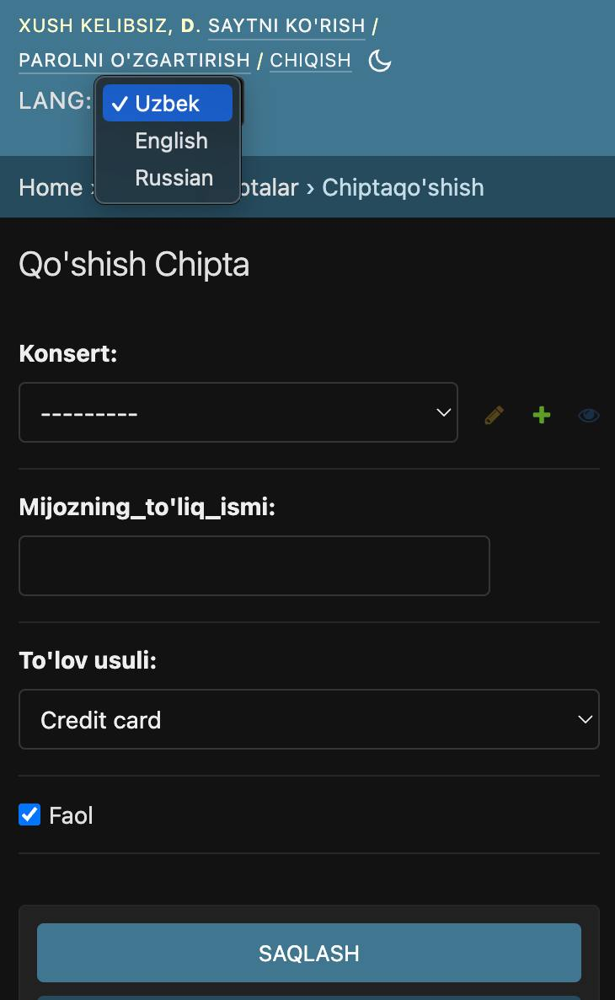
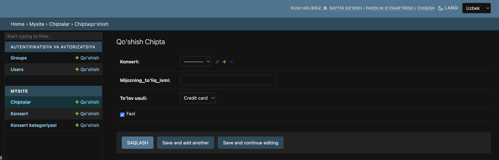

# Django_Multilanguage-manual
 
# Hello dear, how can I translate the django admin panel?

### First of all, I create a 

```bash
mkdir DjangoMultilanguage
cd DjangoMultilanguage
mkdir templates
mkdir static

django-admin startproject myproject .
python manage.py startapp mysite


```
### So Than I creat virtual environment
```bash
1. python3 -m venv venv
than venv activate
2. source venv/bin/activate
```

### In the project setting.py file, add app:

```
INSTALLED_APPS = [
    'django.contrib.admin',
    'django.contrib.auth',
    'django.contrib.contenttypes',
    'django.contrib.sessions',
    'django.contrib.messages',
    'django.contrib.staticfiles',
    'mysite',  #your created app name
]
```
### Configure templates in the project setting.py file:
```
import os

TEMPLATES = [
    {
        'BACKEND': 'django.template.backends.django.DjangoTemplates',
        'DIRS': [os.path.join(BASE_DIR,'templates/')],# change direction
        'APP_DIRS': True,
        'OPTIONS': {
            'context_processors': [
                'django.template.context_processors.debug',
                'django.template.context_processors.request',
                'django.contrib.auth.context_processors.auth',
                'django.contrib.messages.context_processors.messages',
                'International.context_processors.logo_context',
                'django.template.context_processors.i18n', # add that code
            ],
        },
    },
]
```
### Setting static in the project setting.py file:
```
STATIC_URL = '/static/'
STATIC_ROOT = os.path.join(BASE_DIR,'static')
```
### Setting the language in the project setting.py file:
```
LANGUAGES = (
    ('ru',  'Russian'),
    ('en',  'English'),
    ('uz',  'Uzbek')
)
LOCALE_PATHS = (
    os.path.join(BASE_DIR, 'locale'),
)
```

### add url
from django.views.i18n import set_language
```
urlpatterns = [
    path('admin/', admin.site.urls),
    path('i18n/', set_language, name='set_language'),
]
```
### Change Middleware Enter:
```
MIDDLEWARE = [
    'django.middleware.security.SecurityMiddleware',
    'django.contrib.sessions.middleware.SessionMiddleware',
    'django.middleware.locale.LocaleMiddleware',              # add
    'django.middleware.common.CommonMiddleware',
    'django.middleware.csrf.CsrfViewMiddleware',
    'django.contrib.auth.middleware.AuthenticationMiddleware',
    'django.contrib.messages.middleware.MessageMiddleware',
    'django.middleware.clickjacking.XFrameOptionsMiddleware',
]

```

### Create an admin folder in the teplate folder
#### And create a base_site.html file inside it and put this code
```




{{ block.super }}
<style>
    /* Add custom styles here, if needed */
    .language-form {
      display: inline-block;
    }
    .language-label {
      display: inline-block;
      margin-right: 5px;
    }
    .language-select {
      display: inline-block;
    }
  </style>



  {{ block.super }}

  <form class="language-form" id="languageForm" method="post" action="">
    
    <label class="language-label" for="language">Lang:</label>
    <select class="language-select" name="language" id="language" onchange="changeLanguage(this.value)">
        
            
                <option value="{{ lang_code }}" selected>{{ lang_name }}</option>
            
                <option value="{{ lang_code }}">{{ lang_name }}</option>
            
        
    </select>
  </form>

  <script>
    function changeLanguage(languageCode) {
      const form = document.getElementById('languageForm');
      form.elements.language.value = languageCode;
      form.submit();
    }
  </script>


```

### Then we can create models in model.py inside the created app. from django.utils.translation import gettext_lazy as _
```
class ConcertCategory(models.Model):
    name = models.CharField(max_length=64, verbose_name=_('name'))
    description = models.TextField(max_length=256, blank=True, null=True, verbose_name=_("description"))

    VERBOSE_NAME = _('ConcertCategory')
    class Meta:
        verbose_name = _("concert category")
        verbose_name_plural = _("concert categories")
        ordering = ["-name"]

    def __str__(self):
        return f"{self.name}"
```

### Issue commands terminal:
```bash
python manage.py makemigrations
python manage.py migrate
python manage.py createsuperuser   # Create a user admin to enter the product from the section
```

### Created locale folder
```bash
mkdir your_app_name/lacale
```
### issue this command through terminal
```bash
django-admin makemessages --l en #or
django-admin makemessages --all
```
### processing locale ru processing locale uz #you should get an answer like this!
#### go to the uz folder from the locale file and open the file inside look for this code:
```bash
#: mysite/models.py:21
msgid "starts_at"
msgstr "boshlanish sanasi" #add

#: mysite/models.py:22
msgid "price"
msgstr "narx" #add
```

### Issue this command through terminal: to confirm
```bash
django-admin compilemessages
```

 


# [video guide](https://www.youtube.com/watch?v=gVs4GPyXbJk&t=641s)
# [questions and suggestions telegram](https://t.me/majidov_diyorbek)


